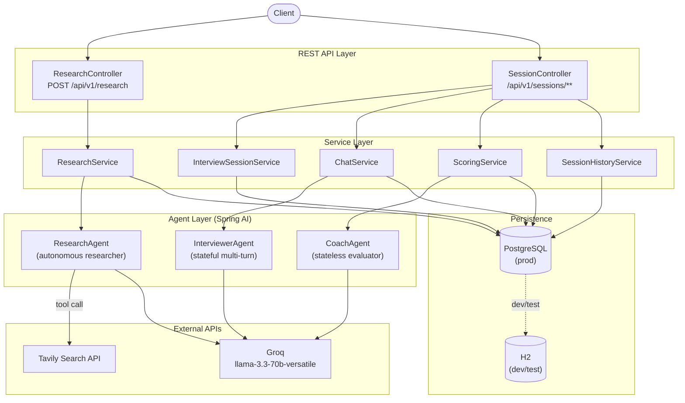

# interview-prep-agent

AI agent that researches companies and simulates mock technical interviews. Given a company name and job description, it researches the company, conducts a multi-turn mock interview, and delivers scored coaching feedback.

**Stack:** Java 21, Spring Boot 3.3.4, Spring AI 1.0.0, Groq (llama-3.3-70b-versatile), PostgreSQL, Oracle Cloud Free Tier

---

## Architecture



---

## API Endpoints

| Method | Path | Description |
|--------|------|-------------|
| POST | `/api/v1/research` | Research a company — returns session ID + CompanyBrief |
| POST | `/api/v1/sessions` | Start a mock interview session |
| POST | `/api/v1/sessions/{id}/chat` | Send a message, get interviewer reply |
| POST | `/api/v1/sessions/{id}/evaluate` | Trigger coaching feedback and scoring |
| GET  | `/api/v1/sessions/{id}` | Fetch session detail |
| GET  | `/api/v1/sessions` | List all sessions |

All responses are wrapped in `ApiResponse<T>`: `{ data, error: { code, message }, meta: { timestamp } }`.

Interactive API docs available at `/swagger-ui/index.html`.

---

## Local Development

### Prerequisites
- Java 21
- Gradle 8.10 (or use the included `./gradlew` wrapper)

### Environment variables
```bash
export GROQ_API_KEY=gsk_...
export TAVILY_API_KEY=tvly-...
```

### Run
```bash
./gradlew bootRun
# App starts on http://localhost:8080 with H2 in-memory DB
```

### Test
```bash
./gradlew test
# 110 tests, all pass
```

---

## Production Deployment

The app runs on an **Oracle Cloud Free Tier Ampere A1 VM (Ubuntu 22.04)** using **Docker Compose** behind a **Caddy v2** reverse proxy.

### 1. VM setup

SSH into your VM and run the setup script:
```bash
curl -fsSL https://raw.githubusercontent.com/sharmavipin1608/interview-prep-agent/master/deploy/setup-vm.sh | bash
```

This installs Docker, Caddy, opens ports 80/443, and creates `/opt/interview-prep-agent/`.

### 2. Create the `.env` file on the VM

```bash
nano /opt/interview-prep-agent/.env
```

```
GROQ_API_KEY=gsk_...
TAVILY_API_KEY=tvly-...
POSTGRES_PASSWORD=choose-a-strong-password
```

### 3. Configure Caddy

Edit `deploy/Caddyfile` — replace the domain with yours:
```
your-domain.com {
    reverse_proxy localhost:8080
    ...
}
```

Copy to the VM and reload:
```bash
scp deploy/Caddyfile ubuntu@<vm-ip>:/tmp/Caddyfile
ssh ubuntu@<vm-ip> "sudo cp /tmp/Caddyfile /etc/caddy/Caddyfile && sudo systemctl reload caddy"
```

Caddy automatically provisions a TLS certificate via Let's Encrypt when a domain name is used.

### 4. GitHub Actions secrets

Add these to your repo (`Settings → Secrets → Actions`):

| Secret | Description |
|--------|-------------|
| `ORACLE_SSH_PRIVATE_KEY` | SSH private key for the Oracle VM |
| `ORACLE_SSH_KNOWN_HOSTS` | Output of `ssh-keyscan <your-vm-ip> 2>/dev/null \| grep -v "^#"` |
| `ORACLE_HOST` | Public IP or hostname of the Oracle VM |
| `ORACLE_USER` | SSH username (typically `ubuntu`) |
| `ORACLE_DEPLOY_PATH` | Remote path, e.g. `/opt/interview-prep-agent/` |

### 5. Deploy

Push to `master` — GitHub Actions runs tests, builds a Docker image, streams it to the VM, and runs `docker compose up -d` automatically.

---

## Project Structure

```
interview-prep-agent/
├── src/
│   ├── main/java/com/vipinsharma/interviewprep/
│   │   ├── agent/          # ResearchAgent, InterviewerAgent, CoachAgent
│   │   ├── api/            # REST controllers + GlobalExceptionHandler
│   │   ├── config/         # AiConfig (ChatClient beans)
│   │   ├── dto/            # Java records (request/response DTOs)
│   │   ├── model/          # JPA entities (Session, Message, Score, WeakArea)
│   │   ├── repository/     # Spring Data JPA repositories
│   │   └── service/        # Business logic services
│   └── main/resources/
│       ├── application.yml
│       ├── application-dev.yml
│       ├── application-test.yml
│       └── application-prod.yml
├── deploy/
│   ├── Caddyfile                      # Caddy v2 reverse proxy config
│   ├── setup-vm.sh                    # One-shot VM setup script
│   └── interview-prep-agent.service   # systemd unit (alternative to Docker)
├── Dockerfile
├── docker-compose.yml
└── .github/workflows/
    └── deploy.yml                     # CI/CD pipeline
```
